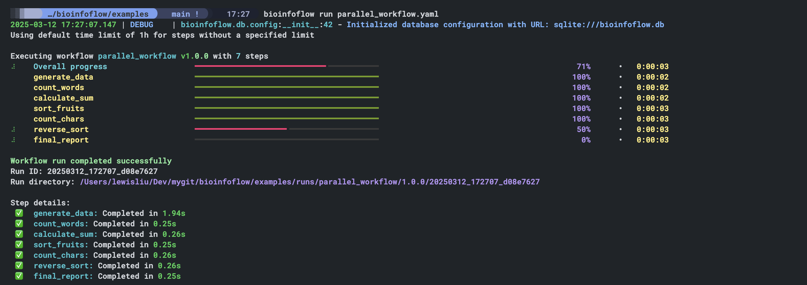
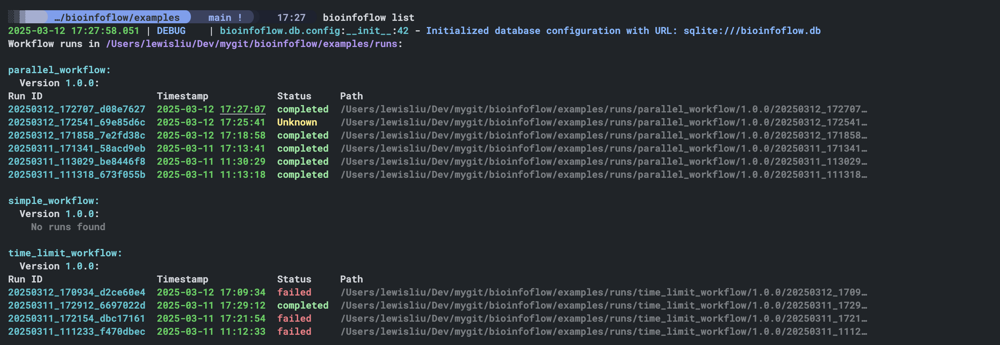
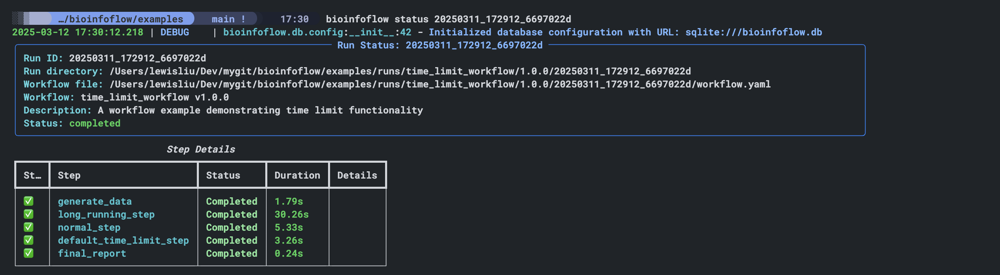

# BioinfoFlow 🧬

A modern, container-native workflow engine for reproducible bioinformatics pipelines.

## 📋 Overview

BioinfoFlow is designed to make bioinformatics workflows reproducible, portable, and easy to manage. Following Occam's razor principle, this MVP focuses on essential functionality:

- 📝 Simple YAML-based workflow definition
- 🔄 Dependency-aware step execution with parallel processing
- ⏱️ Resource management with time limits
- 📂 Automatic directory organization
- 🔍 Detailed execution tracking and reporting

## 🚀 Quick Start

### Installation

```bash
# Install from GitHub
pip install git+https://github.com/lewislovelock/bioinfoflow.git

# Or clone and install in development mode
git clone https://github.com/lewislovelock/bioinfoflow.git
cd bioinfoflow
pip install -e .
```

### Create a Workflow

Create a new workflow definition or use an example workflow:

```bash
# Copy an example workflow
cp examples/simple_workflow.yaml my_workflow.yaml
```

### Run a Workflow

Execute your workflow:

```bash
bioinfoflow run my_workflow.yaml
```

With progress tracking:



### Check Workflow Status

List all workflow runs:

```bash
bioinfoflow list
```



Check a specific run:

```bash
bioinfoflow status <run_id>
```



## 💡 Core Concepts

### Workflow Structure

A workflow consists of:
- **Metadata**: Name, version, and description
- **Configuration**: Directory settings
- **Inputs**: Data paths and parameters
- **Steps**: Individual execution units

### Step Execution

Each step defines:
- 🐳 Container image
- 🖥️ Command to execute
- 🧮 Resource requirements (CPU, memory)
- ⏱️ Optional time limits
- 🔗 Dependencies on other steps

### Directory Organization

BioinfoFlow automatically organizes your files:

```
${base_dir}/
├── refs/          # Reference data
├── workflows/     # Workflow definitions
└── runs/          # Workflow run logs and outputs
    └── <workflow_name>/
        └── <version>/
            └── <run_id>/           # Timestamp + random string
                ├── workflow.yaml   # Copy of workflow definition
                ├── inputs/         # Input files/links
                ├── outputs/        # Generated output files
                ├── logs/           # Execution logs
                └── tmp/            # Temporary files
```

## 📝 Workflow Definition

Here's a simple workflow example:

```yaml
name: simple_workflow
version: "1.0.0"
description: "A simple workflow example"

config:
  base_dir: "."  # Current working directory

inputs:
  path: "input/*.txt"

steps:
  hello_world:
    container: "ubuntu:20.04"
    command: "echo 'Hello, BioinfoFlow!' > ${run_dir}/outputs/hello.txt"
    resources:
      cpu: 1
      memory: "1G"
    after: []

  count_words:
    container: "ubuntu:20.04"
    command: "wc -w ${run_dir}/outputs/hello.txt > ${run_dir}/outputs/word_count.txt"
    resources:
      cpu: 1
      memory: "1G"
    after: [hello_world]
```

## ⚙️ Advanced Features

### Parallel Execution

Run steps in parallel when dependencies allow:

```bash
bioinfoflow run my_workflow.yaml --parallel 4
```

### Time Limits

Set time limits for steps to prevent resource overuse:

```yaml
steps:
  my_step:
    resources:
      time_limit: "30m"  # 30 minutes time limit
```

Control time limits via command line:

```bash
# Disable time limits
bioinfoflow run my_workflow.yaml --disable-time-limits

# Set default time limit
bioinfoflow run my_workflow.yaml --default-time-limit 2h30m
```

### Variable Substitution

Use variables in your commands:
- `${config.parameter}`: Configuration values
- `${inputs.path}`: Input paths
- `${steps.step_name.outputs.output_name}`: Outputs from previous steps
- `${run_dir}`: Current run directory

## 🔍 Path Resolution

BioinfoFlow handles paths intelligently:

- **Absolute paths** (starting with `/`): Used as-is
- **Relative paths**: Resolved based on context:
  - Input paths: Relative to current working directory
  - Output paths: Relative to run outputs directory
  - Reference paths: Relative to references directory

## 🧪 Experimental Features

These features are included as hooks for future expansion:

- 📊 Metadata and tagging
- 🔄 Conditional execution
- 🔔 Pre/post execution hooks
- 📧 Completion notifications

## 📌 Best Practices

- ✅ Use specific container versions (e.g., `image:v1.2.3` not `image:latest`)
- ✅ Document expected inputs and outputs
- ✅ Provide reasonable resource defaults
- ✅ Use relative paths when possible for portability
- ✅ Clean up temporary files in your workflows

## 📚 Complete Example

Here's a complete example of a parallel workflow:

```yaml
name: parallel_workflow
version: "1.0.0"
description: "A workflow example demonstrating parallel execution"

config:
  base_dir: "."  # Current working directory

inputs:
  path: "input/*.txt"  # Input path supporting glob patterns

steps:
  generate_data:
    container: "ubuntu:latest"
    command: |
      echo "apple banana cherry" > ${run_dir}/outputs/fruits.txt
      echo "10 20 30 40 50" > ${run_dir}/outputs/numbers.txt
    resources:
      cpu: 1
      memory: "1G"
    after: []

  count_words:
    container: "ubuntu:latest"
    command: "wc -w ${run_dir}/outputs/fruits.txt > ${run_dir}/outputs/word_count.txt"
    resources:
      cpu: 1
      memory: "1G"
    after: [generate_data]

  calculate_sum:
    container: "ubuntu:latest"
    command: "awk '{sum=0; for(i=1; i<=NF; i++) sum+=$i; print sum}' ${run_dir}/outputs/numbers.txt > ${run_dir}/outputs/sum.txt"
    resources:
      cpu: 1
      memory: "1G"
    after: [generate_data]

  sort_fruits:
    container: "ubuntu:latest"
    command: "cat ${run_dir}/outputs/fruits.txt | tr ' ' '\\n' | sort > ${run_dir}/outputs/sorted_fruits.txt"
    resources:
      cpu: 1
      memory: "1G"
    after: [generate_data]

  count_chars:
    container: "ubuntu:latest"
    command: "wc -c ${run_dir}/outputs/fruits.txt > ${run_dir}/outputs/char_count.txt"
    resources:
      cpu: 1
      memory: "1G"
    after: [generate_data]

  reverse_sort:
    container: "ubuntu:latest"
    command: "cat ${run_dir}/outputs/sorted_fruits.txt | sort -r > ${run_dir}/outputs/reverse_sorted.txt"
    resources:
      cpu: 1
      memory: "1G"
    after: [sort_fruits]

  final_report:
    container: "ubuntu:latest"
    command: |
      echo "Workflow Report" > ${run_dir}/outputs/report.txt
      echo "Word count: $(cat ${run_dir}/outputs/word_count.txt)" >> ${run_dir}/outputs/report.txt
      echo "Sum: $(cat ${run_dir}/outputs/sum.txt)" >> ${run_dir}/outputs/report.txt
      echo "Char count: $(cat ${run_dir}/outputs/char_count.txt)" >> ${run_dir}/outputs/report.txt
      echo "Sorted fruits: $(cat ${run_dir}/outputs/sorted_fruits.txt | tr '\\n' ' ')" >> ${run_dir}/outputs/report.txt
      echo "Reverse sorted: $(cat ${run_dir}/outputs/reverse_sorted.txt | tr '\\n' ' ')" >> ${run_dir}/outputs/report.txt
    resources:
      cpu: 1
      memory: "1G"
    after: [count_words, calculate_sum, count_chars, reverse_sort]
```

Run with parallel execution:

```bash
bioinfoflow run parallel_workflow.yaml --parallel 4
```

## 📄 Version Information

This document describes BioinfoFlow MVP v0.1.0.

Future versions will expand functionality based on user feedback while maintaining the core principles of simplicity and reproducibility.